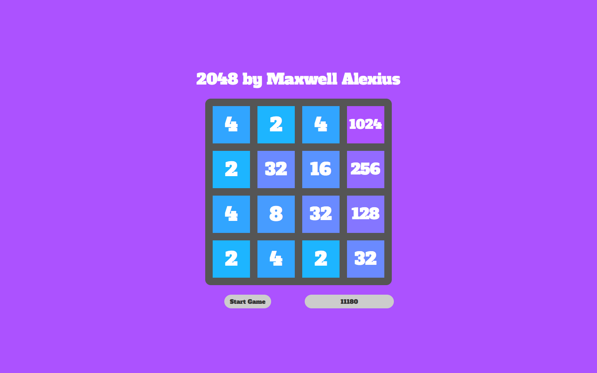
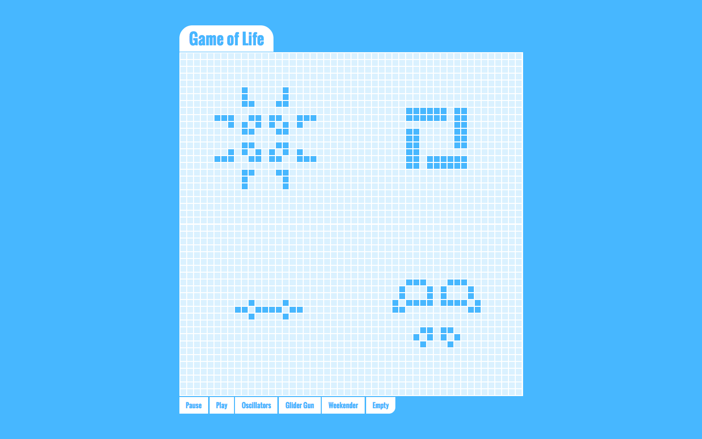
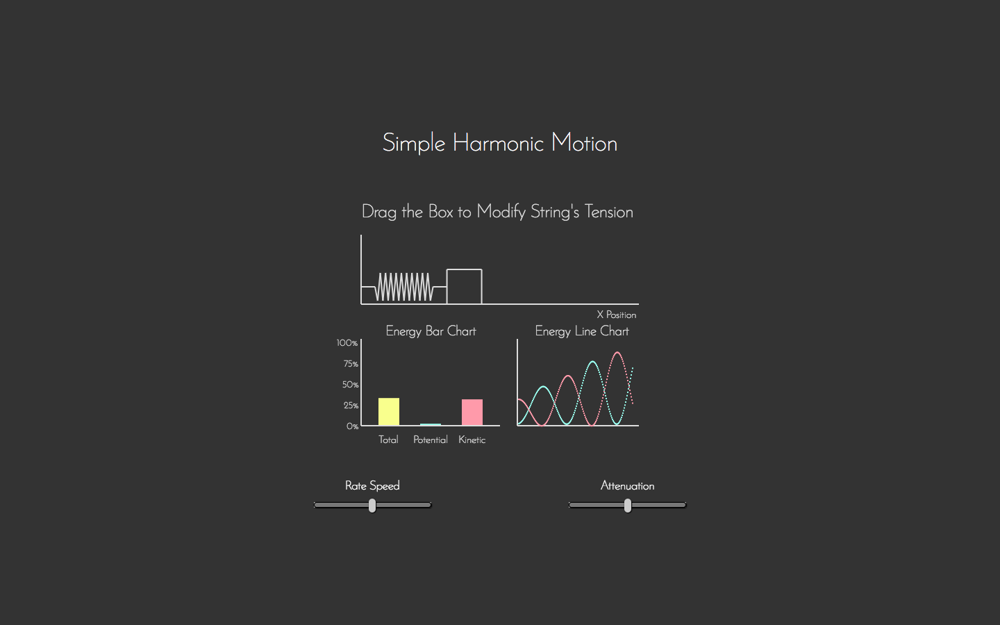
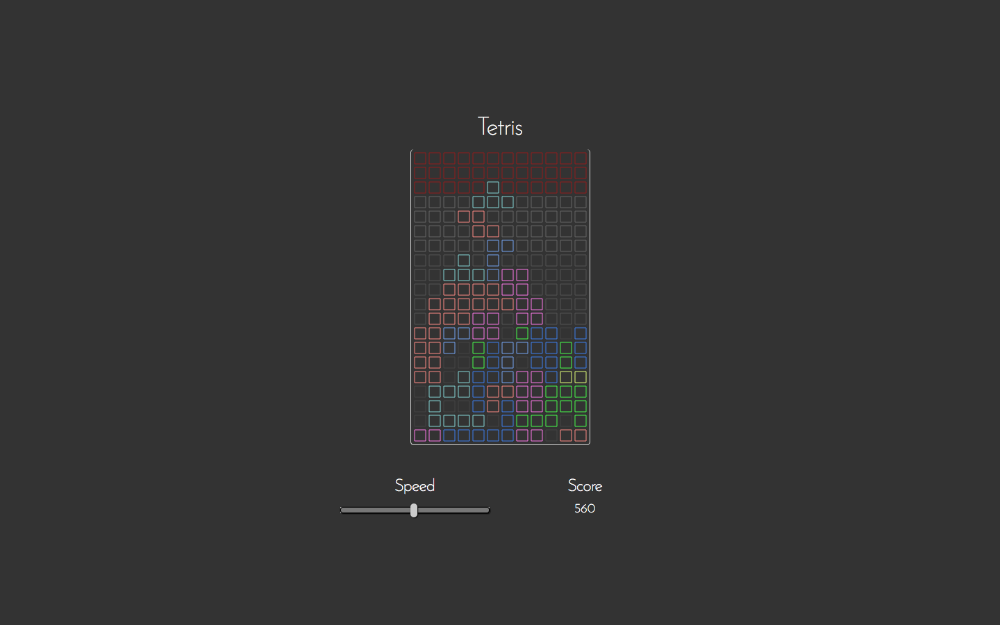
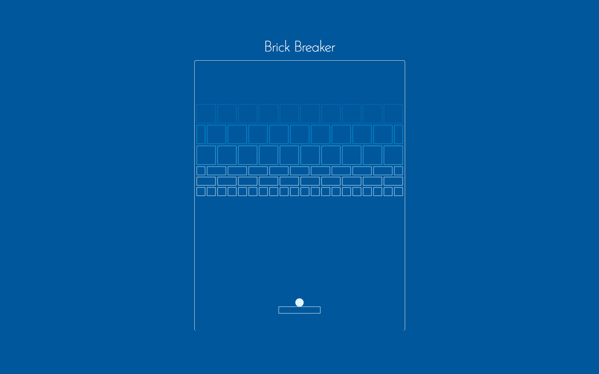
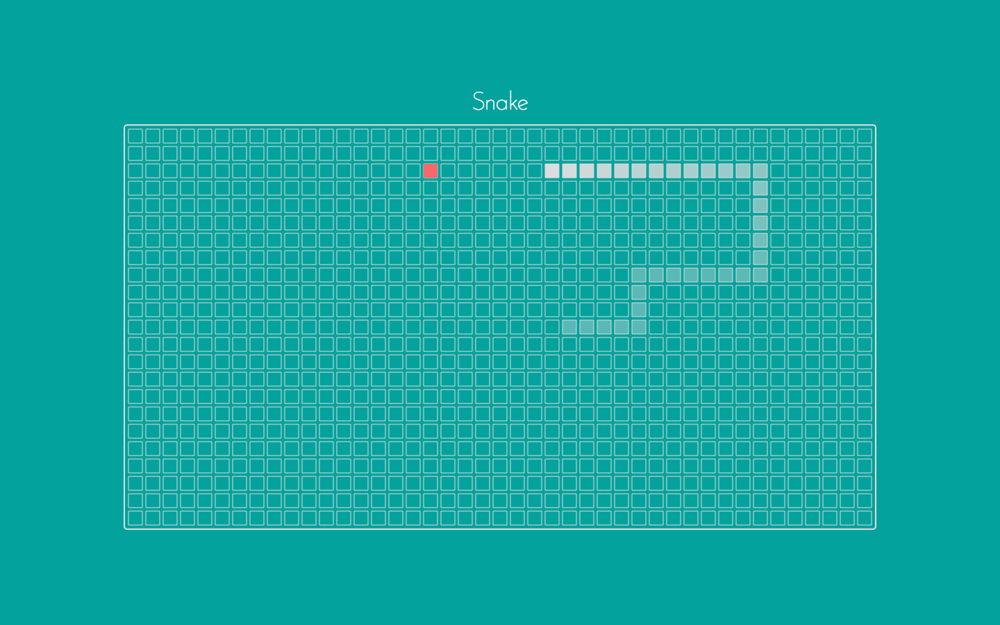
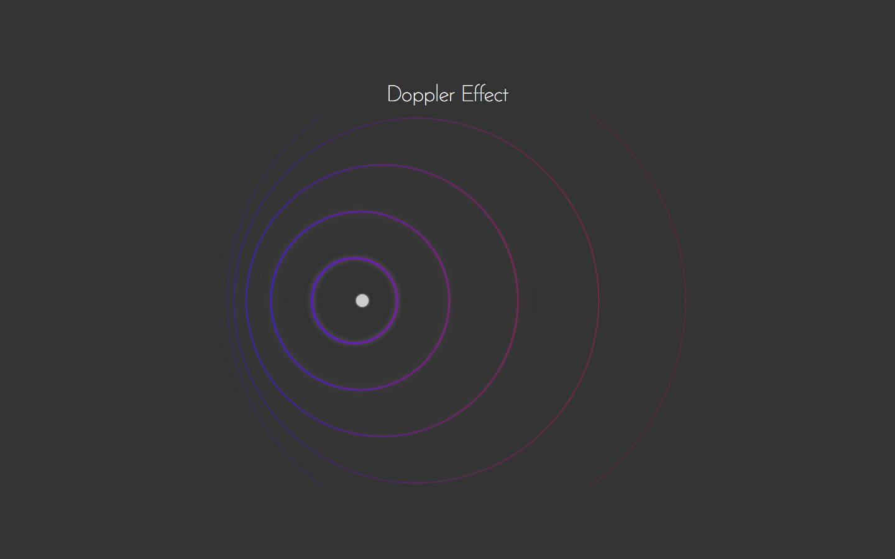
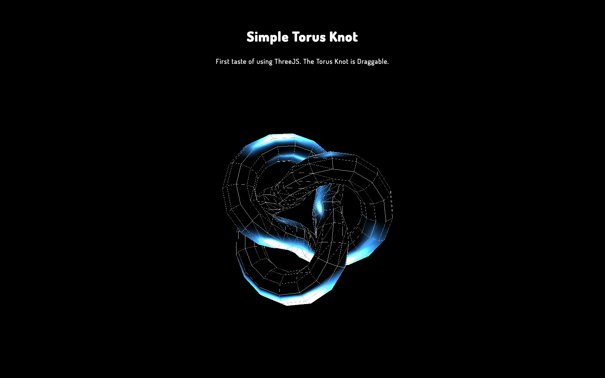
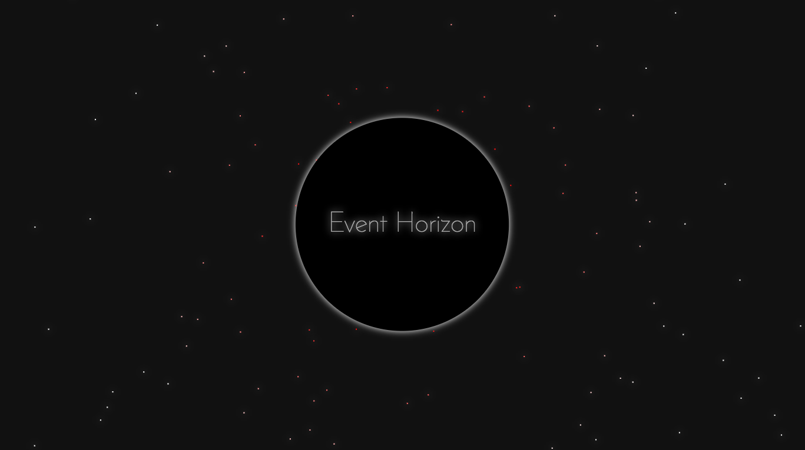
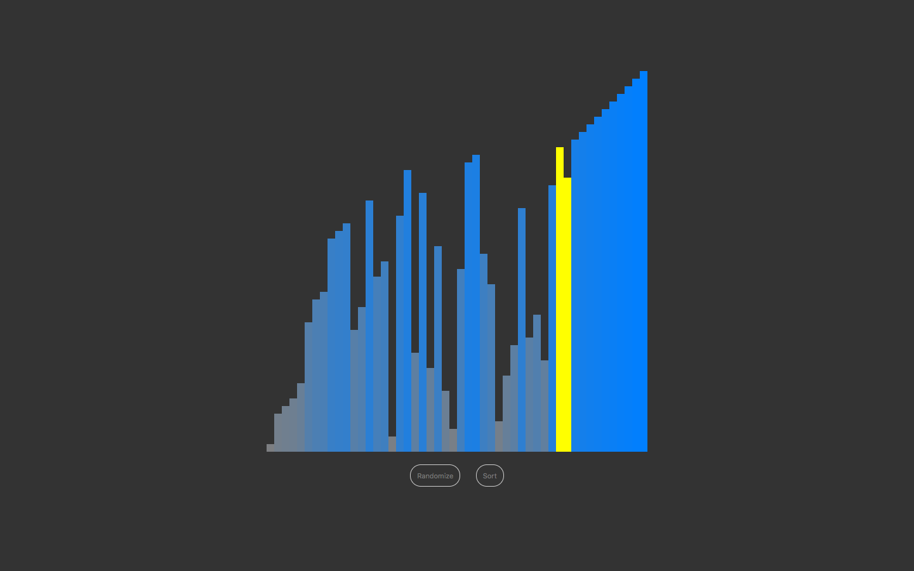

# Maxwell's CodePen Projects
---

Here is the list of the pens' source code, enjoy =) ~

- 2017.01.02 <a href="http://codepen.io/maxwell_alexius/pen/jyNvYB">Horizontal List with My Skill Sets</a>
- 2017.01.05 <a href="http://codepen.io/maxwell_alexius/pen/BpaKKp">2048 by Maxwell Alexius</a>
- 2017.01.11 <a href="http://codepen.io/maxwell_alexius/pen/KaVENm">Game of Life</a>
- 2017.01.13 <a href="http://codepen.io/maxwell_alexius/pen/GrqKZQ">Simple Harmonic Motion</a>
- 2017.01.16 <a href="http://codepen.io/maxwell_alexius/pen/oBzppK">Tetris</a>
- 2017.01.22 <a href="http://codepen.io/maxwell_alexius/pen/PWmJmw">Brick Breaker</a>
- 2017.01.25 <a href="http://codepen.io/maxwell_alexius/pen/ZLJabv">Slippy Snake</a>
- 2017.01.26 <a href="http://codepen.io/maxwell_alexius/pen/VPzVqL">Doppler Effect</a>
- 2017.01.28 <a href="http://codepen.io/maxwell_alexius/pen/RKjRMz">Simple Torus Knot</a>
- 2017.02.02 <a href="http://codepen.io/maxwell_alexius/pen/MJVrqv">Event Horizon</a>
- 2017.02.17 <a href="http://codepen.io/maxwell_alexius/pen/WRYWNp">HTML5 Canvas Canvas</a>
- 2017.03.16 <a href="http://codepen.io/maxwell_alexius/pen/WpXejG">Visualized Bubble Sort</a>

Screenshots :

