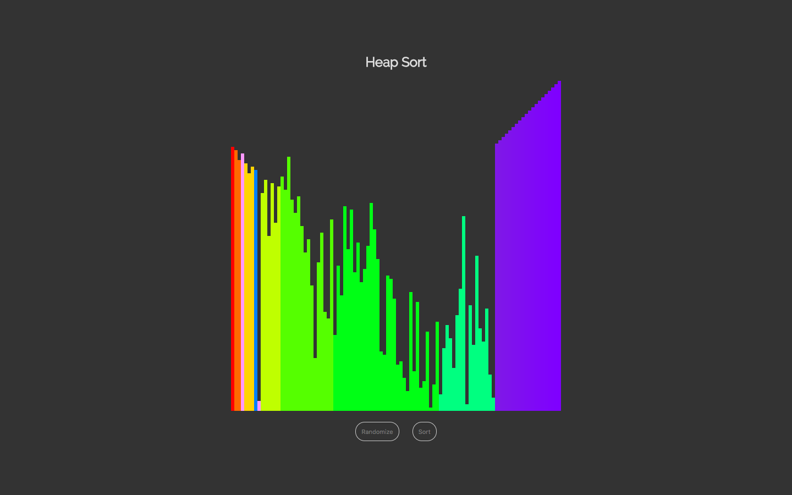

<h1 align="center">Maxwell's CodePen Projects</h1>

<h3 align="center">Here is the list of my pens' source code, enjoy =)</h3>

- 2017.01.02 <a href="http://codepen.io/maxwell_alexius/pen/jyNvYB">Horizontal List with My Skill Sets</a>
- 2017.01.05 <a href="http://codepen.io/maxwell_alexius/pen/BpaKKp">2048 by Maxwell Alexius</a>
- 2017.01.11 <a href="http://codepen.io/maxwell_alexius/pen/KaVENm">Game of Life</a>
- 2017.01.13 <a href="http://codepen.io/maxwell_alexius/pen/GrqKZQ">Simple Harmonic Motion</a>
- 2017.01.16 <a href="http://codepen.io/maxwell_alexius/pen/oBzppK">Tetris</a>
- 2017.01.22 <a href="http://codepen.io/maxwell_alexius/pen/PWmJmw">Brick Breaker</a>
- 2017.01.25 <a href="http://codepen.io/maxwell_alexius/pen/ZLJabv">Slippy Snake</a>
- 2017.01.26 <a href="http://codepen.io/maxwell_alexius/pen/VPzVqL">Doppler Effect</a>
- 2017.01.28 <a href="http://codepen.io/maxwell_alexius/pen/RKjRMz">Simple Torus Knot</a>
- 2017.02.02 <a href="http://codepen.io/maxwell_alexius/pen/MJVrqv">Event Horizon</a>
- 2017.02.17 <a href="http://codepen.io/maxwell_alexius/pen/WRYWNp">HTML5 Canvas Canvas</a>
- 2017.03.16 <a href="http://codepen.io/maxwell_alexius/pen/WpXejG">Visualized Bubble Sort</a>
- 2017.03.21 <a href="http://codepen.io/maxwell_alexius/pen/peLbRR">Visualized Merge Sort</a>
- 2017.03.22 <a href="http://codepen.io/maxwell_alexius/pen/zZWbNE">Visualized Comb Sort</a>
- 2017.03.26 <a href="http://codepen.io/maxwell_alexius/pen/peVrMx">Visualized Quick Sort</a>
- 2017.04.01 <a href="http://codepen.io/maxwell_alexius/pen/jBXpRK">Visualized Heap Sort</a>
- 2017.05.01 <a href="https://codepen.io/maxwell_alexius/pen/qmmKOj">Orbital Image Gallery</a>
- 2017.06.27 <a href="https://codepen.io/maxwell_alexius/pen/prRvvO">Network Space</a>
- 2017.08.06 <a href="https://codepen.io/maxwell_alexius/pen/VzPYYa">Mine Sweeper</a>
- 2017.09.03 <a href="https://codepen.io/maxwell_alexius/pen/oeVxod">Python Syntax Highlighter</a>
- 2017.10.08 <a href="https://codepen.io/maxwell_alexius/full/EwEVXj/">Linear Regression - Gradient Descent</a>
- 2017.11.16 <a href="https://codepen.io/maxwell_alexius/full/vWeeLQ/">Visualize K-Means</a>

Screenshots :

